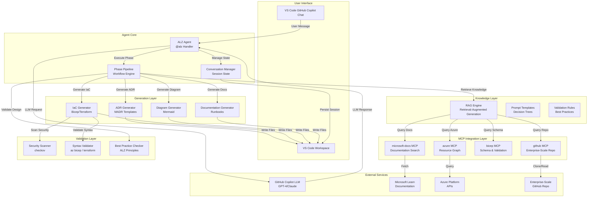
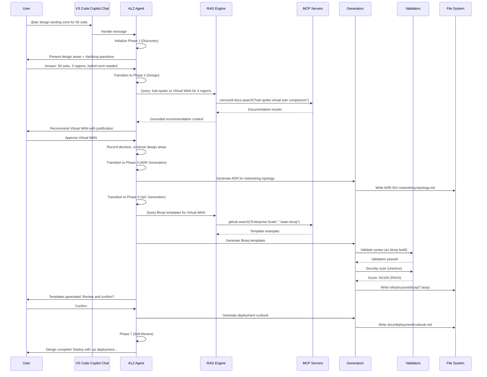
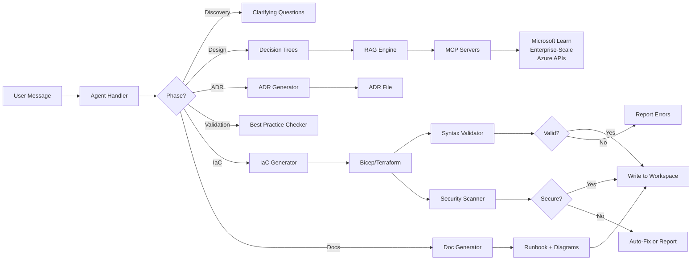
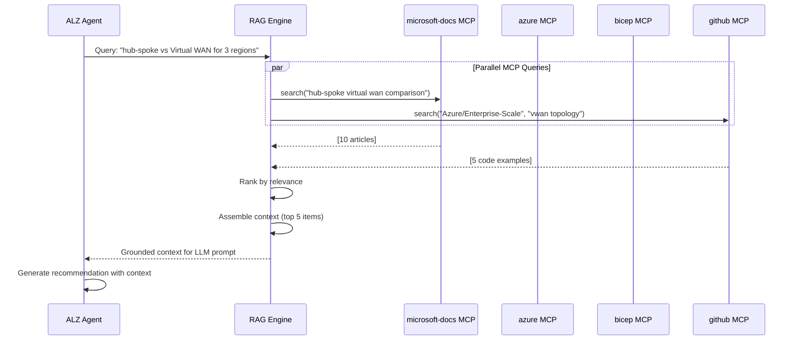

# Landing Zone Provisioning Agent - Technical Architecture

> **Document Version**: 1.0.0  
> **Last Updated**: 2026-05-11  
> **Status**: Design Phase

## Overview

The Landing Zone Provisioning Agent integrates with **GitHub Copilot** to provide conversational Azure Landing Zone architecture guidance within Visual Studio Code. This document describes the technical architecture, component interactions, data flows, and integration patterns.

## Architecture Diagram

### High-Level System Architecture



### Component Interaction Flow



## Component Specifications

### 1. Agent Core

#### 1.1 ALZ Agent Handler
- **Technology**: TypeScript/JavaScript (VS Code Extension API)
- **Responsibilities**:
  - Parse `@alz` mentions in Copilot Chat
  - Route commands (`/design`, `/validate`, `/generate`, `/diagram`)
  - Manage conversation context (last 20 turns)
  - Orchestrate phase pipeline execution
- **Key Methods**:
  - `handleMessage(message: string): Promise<Response>`
  - `executePhase(phase: Phase): Promise<PhaseResult>`
  - `generateArtifacts(type: ArtifactType): Promise<Files>`

#### 1.2 Conversation Manager
- **Technology**: Local JSON storage (`.vscode/alz-agent-session.json`)
- **Responsibilities**:
  - Persist conversation state across VS Code restarts
  - Track current phase and progress
  - Store user decisions and requirements
  - Manage session metadata (start time, user ID, workspace)
- **Schema**:
  ```json
  {
    "sessionId": "uuid",
    "startTime": "2026-05-11T10:00:00Z",
    "currentPhase": "Phase 2: Architecture Design",
    "decisions": {
      "networkingTopology": "Virtual WAN",
      "managementGroups": { "depth": 3, "structure": "..." }
    },
    "conversationHistory": [
      { "role": "user", "content": "...", "timestamp": "..." },
      { "role": "agent", "content": "...", "timestamp": "..." }
    ]
  }
  ```

#### 1.3 Phase Pipeline Engine
- **Technology**: State machine implementation (XState or custom)
- **Responsibilities**:
  - Enforce phase sequencing (Phase 1 → Phase 2 → ... → Phase 7)
  - Validate phase gate criteria before transitions
  - Track completion status per phase
  - Handle phase rollback if gate fails
- **Phase Transitions**:
  ```typescript
  enum Phase {
    DISCOVERY = "Phase 1: Requirements Discovery",
    DESIGN = "Phase 2: Architecture Design",
    ADR = "Phase 3: ADR Generation",
    VALIDATION = "Phase 4: Best Practice Validation",
    IAC = "Phase 5: IaC Generation",
    DOCUMENTATION = "Phase 6: Documentation",
    REVIEW = "Phase 7: Self-Review"
  }
  ```

### 2. Knowledge Layer

#### 2.1 RAG Engine
- **Technology**: LangChain or custom RAG implementation
- **Responsibilities**:
  - Query MCP servers for relevant documentation
  - Embed and index frequently accessed content
  - Rank and retrieve top-k relevant documents
  - Combine retrieved context with user query for LLM
- **Pipeline**:
  1. Query formulation from conversation context
  2. MCP server queries (parallel execution)
  3. Result ranking by relevance
  4. Context window packing (stay under 128K tokens)
  5. Prompt assembly with retrieved context

#### 2.2 Prompt Templates
- **Location**: `prompts/alz-agent/`
- **Templates**:
  - `discovery.md`: Clarifying questions for requirements
  - `decision-tree-networking.md`: Hub-spoke vs Virtual WAN
  - `decision-tree-mgmt-groups.md`: Management group hierarchy
  - `decision-tree-identity.md`: Azure AD vs AD DS
  - `adr-generation.md`: ADR template population
  - `validation.md`: Best practice checks
- **Format**: Markdown with variable placeholders

#### 2.3 Validation Rules
- **Location**: `validation/rules/`
- **Categories**:
  - **ALZ Design Principles**: Subscription democratization, policy-driven governance, single control plane
  - **Security Anti-Patterns**: Public IPs on management, RDP/SSH from internet, no Azure Firewall
  - **Structural Checks**: Management group depth ≤4, naming conventions, policy assignments
- **Format**: JSON schema + JavaScript validation functions

### 3. MCP Integration Layer

#### 3.1 Microsoft Docs MCP
- **Server**: `microsoft-docs`
- **Operations**:
  - `search(query: string, maxResults: 10)`: Search Microsoft Learn
  - `fetch(url: string)`: Retrieve full article in Markdown
- **Usage**: Grounding for architecture recommendations, best practices lookup

#### 3.2 Azure MCP
- **Server**: `azure`
- **Operations**:
  - `resourceGraph.query(kusto: string)`: Query subscriptions, resources
  - `listRegions()`: Get available Azure regions
  - `policy.list()`: Get built-in policy definitions
- **Usage**: Subscription validation, region availability, policy reference

#### 3.3 Bicep MCP
- **Server**: `bicep`
- **Operations**:
  - `build(file: string)`: Validate Bicep syntax
  - `getResourceSchema(type: string)`: Get Azure resource type schema
  - `bestPractices(resource: string)`: Get recommendations for resource type
- **Usage**: IaC validation, schema lookup, best practice guidance

#### 3.4 GitHub MCP
- **Server**: `github`
- **Operations**:
  - `search(repo: "Azure/Enterprise-Scale", query: string)`: Search code
  - `getFile(repo: string, path: string)`: Retrieve file content
  - `listReleases(repo: string)`: Get latest versions
- **Usage**: Retrieve Enterprise-Scale reference templates, policy definitions

### 4. Generation Layer

#### 4.1 ADR Generator
- **Input**: Decision context from conversation
- **Template**: MADR (Markdown Any Decision Records)
- **Output**: `docs/architecture/decisions/ADR-{number}-{title}.md`
- **Sections**:
  - Title, Status, Context, Decision, Consequences, Alternatives Considered, Links
- **Logic**:
  - Extract decision from conversation history
  - Query MCP for supporting documentation
  - Populate template with tradeoff analysis
  - Cross-reference related ADRs

#### 4.2 IaC Generator
- **Input**: Architecture decisions + parameters (regions, subscription IDs, naming prefix)
- **Outputs**:
  - **Bicep**: `infrastructure/bicep/*.bicep`
  - **Terraform**: `infrastructure/terraform/*.tf`
- **Logic**:
  - Retrieve Enterprise-Scale templates via GitHub MCP
  - Customize based on decisions (hub-spoke vs VWAN, # regions, etc.)
  - Generate parameter files for dev/test/prod
  - Add inline comments explaining configurations
- **Modules**:
  - Management groups, Policy assignments, Hub networking, Identity resources

#### 4.3 Diagram Generator
- **Input**: Architecture structure (management groups, network topology)
- **Output**: Mermaid diagram code in Markdown
- **Diagram Types**:
  - **Tree**: Management group hierarchy
  - **Graph**: Network topology with VNets, peering, gateways
  - **Sequence**: Data flow (on-premises → ExpressRoute → hub → spoke)
- **Logic**:
  - Convert architecture structure to Mermaid syntax
  - Add styling (colors, icons, labels)
  - Embed in Markdown with code fence

#### 4.4 Documentation Generator
- **Input**: Architecture decisions, IaC templates, deployment steps
- **Outputs**:
  - `docs/deployment/runbook.md`: Step-by-step deployment guide
  - `docs/glossary.md`: Terms and definitions
  - `docs/faq.md`: Common questions
- **Logic**:
  - Extract deployment commands from IaC templates
  - Add prerequisites (Azure CLI version, permissions)
  - Include expected outputs and troubleshooting tips

### 5. Validation Layer

#### 5.1 Security Scanner
- **Tool**: `checkov` (open-source IaC security scanner)
- **Execution**: `checkov -d infrastructure/ --output json`
- **Checks**:
  - No hardcoded secrets
  - Private endpoints enabled
  - Storage accounts use encryption
  - Network security groups properly configured
- **Auto-Fix**: For common issues (e.g., enable encryption, add private endpoint config)
- **Threshold**: Score ≥90/100 to pass

#### 5.2 Syntax Validator
- **Bicep**: `az bicep build --file main.bicep`
- **Terraform**: `terraform validate && tflint`
- **Execution**: Runs before saving files to workspace
- **Failure Handling**: If validation fails, report errors to user and suggest fixes

#### 5.3 Best Practice Checker
- **Rules**: Loaded from `validation/rules/alz-principles.json`
- **Checks**:
  - Subscription democratization: No manual subscription workflows
  - Policy-driven governance: All resource locks via policy
  - Single control plane: No parallel management systems
  - Management group depth: ≤4 levels
  - Naming conventions: Follow Azure naming best practices
- **Output**: Validation report with CRITICAL / WARNING / INFO severity

## Data Flow

### Conversation to Artifact Pipeline



### MCP Query Flow



## File System Structure

```
ALZAgent/
├── .github/
│   ├── agents/
│   │   └── alz-agent.agent.md                 # Agent definition (this file)
│   ├── skills/
│   │   └── alz-architecture/                  # Custom skill for ALZ
│   │       └── SKILL.md
│   └── workflows/
│       └── validate-iac.yml                    # CI/CD for generated IaC
├── .vscode/
│   ├── alz-agent-session.json                 # Session state (gitignored)
│   └── settings.json                           # Workspace settings
├── docs/
│   ├── architecture/
│   │   ├── decisions/                          # ADRs generated by agent
│   │   │   ├── README.md
│   │   │   ├── ADR-001-networking-topology.md
│   │   │   ├── ADR-002-management-groups.md
│   │   │   └── ...
│   │   ├── diagrams/                           # Mermaid diagrams
│   │   │   ├── management-groups.md
│   │   │   ├── network-topology.md
│   │   │   └── data-flow.md
│   │   └── technical-architecture.md           # This file
│   ├── artifacts/
│   │   └── prd/
│   │       └── PRD-ALZ-Agent.md                # Product requirements
│   ├── deployment/
│   │   └── runbook.md                          # Deployment guide
│   ├── glossary.md                             # Terms and definitions
│   ├── faq.md                                  # Common questions
│   └── requirements.md                         # Requirements summary
├── evaluation/
│   ├── datasets/
│   │   └── alz-scenarios.jsonl                 # Test scenarios
│   └── rubrics/
│       └── alz-agent-quality.md                # Quality rubric
├── infrastructure/
│   ├── bicep/                                  # Generated Bicep templates
│   │   ├── main.bicep
│   │   ├── managementGroups.bicep
│   │   ├── policies.bicep
│   │   ├── networking.bicep
│   │   ├── parameters.dev.json
│   │   ├── parameters.test.json
│   │   ├── parameters.prod.json
│   │   └── README.md
│   └── terraform/                              # Generated Terraform configs
│       ├── main.tf
│       ├── variables.tf
│       ├── outputs.tf
│       ├── versions.tf
│       ├── terraform.tfvars
│       └── README.md
├── prompts/
│   └── alz-agent/                              # Prompt templates
│       ├── discovery.md
│       ├── decision-tree-networking.md
│       ├── decision-tree-mgmt-groups.md
│       └── ...
├── src/
│   ├── agent/
│   │   ├── handler.ts                          # Main agent handler
│   │   ├── conversation-manager.ts             # Session state
│   │   └── phase-pipeline.ts                   # Workflow engine
│   ├── generators/
│   │   ├── adr-generator.ts
│   │   ├── iac-generator.ts
│   │   ├── diagram-generator.ts
│   │   └── doc-generator.ts
│   ├── rag/
│   │   ├── rag-engine.ts
│   │   └── mcp-client.ts
│   └── validation/
│       ├── security-scanner.ts
│       ├── syntax-validator.ts
│       └── best-practice-checker.ts
├── validation/
│   └── rules/
│       ├── alz-principles.json                 # Validation rules
│       └── security-patterns.json
├── .gitignore
├── package.json                                # Node.js dependencies
├── tsconfig.json                               # TypeScript config
└── README.md                                   # Project overview
```

## Technology Stack

### Core Technologies
- **Language**: TypeScript/JavaScript
- **Runtime**: Node.js 18+
- **Framework**: VS Code Extension API
- **LLM Backend**: GitHub Copilot (GPT-4/Claude)
- **State Management**: XState or custom state machine

### Dependencies
- `@vscode/copilot-chat`: GitHub Copilot Chat integration
- `langchain`: RAG and LLM orchestration
- `@modelcontextprotocol/sdk`: MCP client library
- `mermaid`: Diagram generation (via CLI or library)
- `ajv`: JSON schema validation
- `yaml`: YAML parsing for config files

### External Tools
- `az` (Azure CLI): Bicep validation
- `terraform`: Terraform validation
- `tflint`: Terraform linting
- `checkov`: Security scanning

## Security Architecture

### Credential Management
- **No Storage**: Agent never stores credentials
- **User Instructions**: Guide users to use Managed Identities or Service Principals
- **Key Vault References**: Generated IaC uses Key Vault for secrets
- **Secret Detection**: Regex patterns detect accidental secret pasting in chat

### Data Privacy
- **Local Storage**: Session state saved to `.vscode/` (gitignored)
- **No Cloud Sync**: Conversation history stays on local machine (opt-in cloud sync in v1.1)
- **Telemetry**: Opt-in only; no PII collected

### Code Security
- **Scanning**: All generated IaC scanned with `checkov`
- **Auto-Fix**: Common vulnerabilities fixed automatically
- **Threshold**: Score ≥90/100 required to pass
- **User Notification**: "✅ 3 security issues auto-fixed" message

## Performance Optimization

### Response Latency
- **Target**: ≤5s (95th percentile)
- **Techniques**:
  - Parallel MCP queries (fan-out, fan-in)
  - Aggressive caching of frequently accessed docs
  - Streaming LLM responses for long outputs
  - Progress indicators ("Searching Microsoft Learn...")

### IaC Generation Speed
- **Target**: ≤30s for complete templates
- **Techniques**:
  - Template reuse (customize from Enterprise-Scale base)
  - Incremental generation (write files as they're generated)
  - Background validation (don't block on checkov scan)

### Context Window Management
- **Limit**: 128K tokens (GitHub Copilot)
- **Techniques**:
  - Summarize old conversation turns (retain key facts only)
  - Offload decisions to ADR files (reference, don't re-state)
  - Paginated diagram generation (split large topologies)

## Deployment Architecture

### VS Code Extension Distribution
- **Package Format**: `.vsix` (VS Code Extension)
- **Registry**: VS Code Marketplace
- **Installation**: `code --install-extension alz-agent-1.0.0.vsix`
- **Updates**: Auto-update via marketplace

### MCP Server Hosting
- **microsoft-docs**: Hosted by Microsoft (public endpoint)
- **azure**: Uses user's Azure CLI credentials (local execution)
- **bicep**: Local execution (requires `az` CLI)
- **github**: Public GitHub API (rate-limited, may require PAT)

### Agent Runtime
- **Execution**: Runs in VS Code Extension Host process
- **Isolation**: Sandboxed per VS Code security model
- **Permissions**: File system access limited to workspace folder

## Monitoring and Telemetry

### Metrics (Opt-In)
- **Usage**: Sessions started, phases completed, artifacts generated
- **Performance**: Response latency, generation time, MCP latency
- **Quality**: Deployment success rate, security scan scores, user satisfaction (NPS)
- **Errors**: LLM failures, MCP timeouts, validation errors

### Logging
- **Local Log**: `.vscode/alz-agent.log` (debug level)
- **User Opt-In**: Send anonymized logs to telemetry service
- **Retention**: Local logs rotate after 7 days

### Error Tracking
- **Sentry or Application Insights**: Crash reporting and diagnostics
- **Stack Traces**: Full context for debugging (PII redacted)

## Testing Strategy

### Unit Tests
- **Coverage**: ≥80% for core logic (generators, validators)
- **Framework**: Jest or Vitest
- **Mocks**: MCP servers mocked for deterministic tests

### Integration Tests
- **Scenarios**: End-to-end flows (discovery → design → IaC → validation)
- **Test Subscription**: Azure test subscription for deployment validation
- **Artifacts**: Verify generated files match expected structure

### Evaluation Suite
- **Dataset**: 100 ALZ test scenarios (`evaluation/datasets/alz-scenarios.jsonl`)
- **Metrics**: Accuracy (90%), deployment success (95%), security (100%)
- **Frequency**: Nightly automated runs

## Open Technical Questions

1. **Q**: Should agent support multiple LLM backends (Azure OpenAI, Anthropic, local models)?
   - **A**: Start with GitHub Copilot only; add others if demand high (PRD Section 10.1)

2. **Q**: How to handle organization-specific policies (custom tags, VM SKUs)?
   - **A**: v1.0 uses config file approach; v1.1 integrates with Azure Policy API (PRD Section 10.2)

3. **Q**: Should session history sync to cloud (GitHub account)?
   - **A**: Local-only for v1.0; opt-in cloud sync for v1.1 (PRD Section 10.3)

---

**Document Status**: ✅ Complete - Ready for implementation planning
